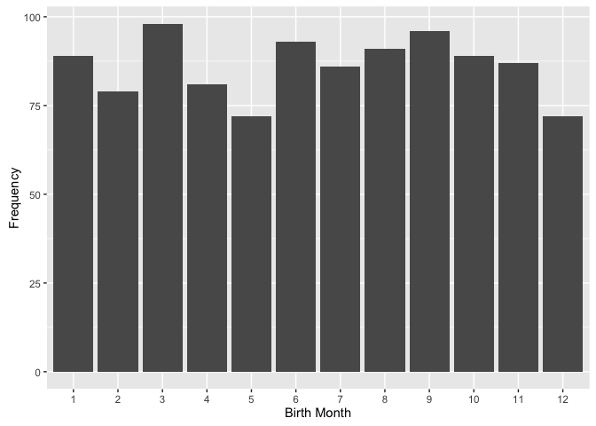
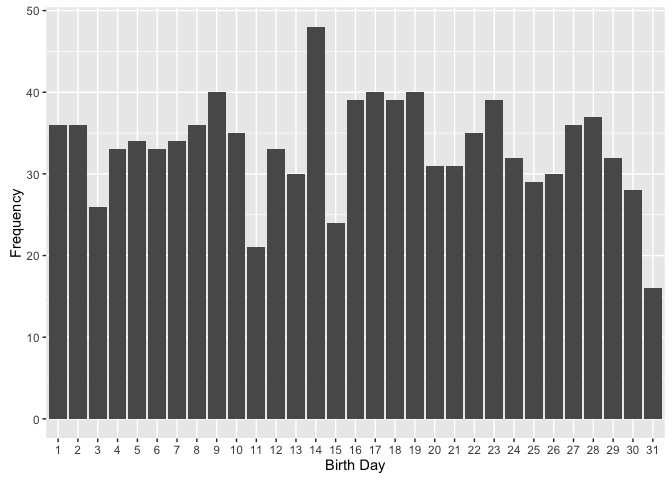

# Friends Birthday Analysis
**Load libraries and data**

```r
library(ggplot2)
```

```
## Warning: package 'ggplot2' was built under R version 3.1.3
```

```r
library(dplyr)
```

```
## Warning: package 'dplyr' was built under R version 3.1.3
```

```
## 
## Attaching package: 'dplyr'
```

```
## The following objects are masked from 'package:stats':
## 
##     filter, lag
```

```
## The following objects are masked from 'package:base':
## 
##     intersect, setdiff, setequal, union
```

```r
library(tidyr)
```

```
## Warning: package 'tidyr' was built under R version 3.1.3
```

```r
df <- read.csv("birthdaysExample.csv")
```

#**How many people share your birthday?**

```r
my_birthday <- filter(df, grepl("8/8", dates))
nrow(my_birthday)
```

```
## [1] 3
```
**Three people share my birthday**


#**Which month contains the most number of birthdays?**

```r
df <- separate(df, dates, into = c("month", "day", "year"), sep = "/")
df <- arrange(df, month, day)

ggplot(df) + geom_bar(aes(x = month)) + scale_x_discrete(limits = c(1,2,3,4,5,6,7,8,9,10,11,12)) + 
  scale_y_continuous() + xlab('Birth Month') + 
  ylab('Frequency')
```

<!-- -->

**March contains the most birthdays**


#**How many birthdays are in each month?**

```r
sort(table(df$month))
```

```
## 
## 12  5  2  4  7 11  1 10  8  6  9  3 
## 72 72 79 81 86 87 89 89 91 93 96 98
```


#**Which day of the year has the most number of birthdays?**

```r
ggplot(df) + geom_bar(aes(x = day)) + scale_x_discrete(limits = c(1:31)) + scale_y_continuous() + xlab('Birth Day') + ylab('Frequency')
```

<!-- -->

```r
sort(table(df$day))
```

```
## 
## 31 11 15  3 30 25 13 26 20 21 24 29 12  4  6  5  7 10 22  1  2 27  8 28 16 
## 16 21 24 26 28 29 30 30 31 31 32 32 33 33 33 34 34 35 35 36 36 36 36 37 39 
## 18 23 17 19  9 14 
## 39 39 40 40 40 48
```
**The 14th is the most common day born on**
